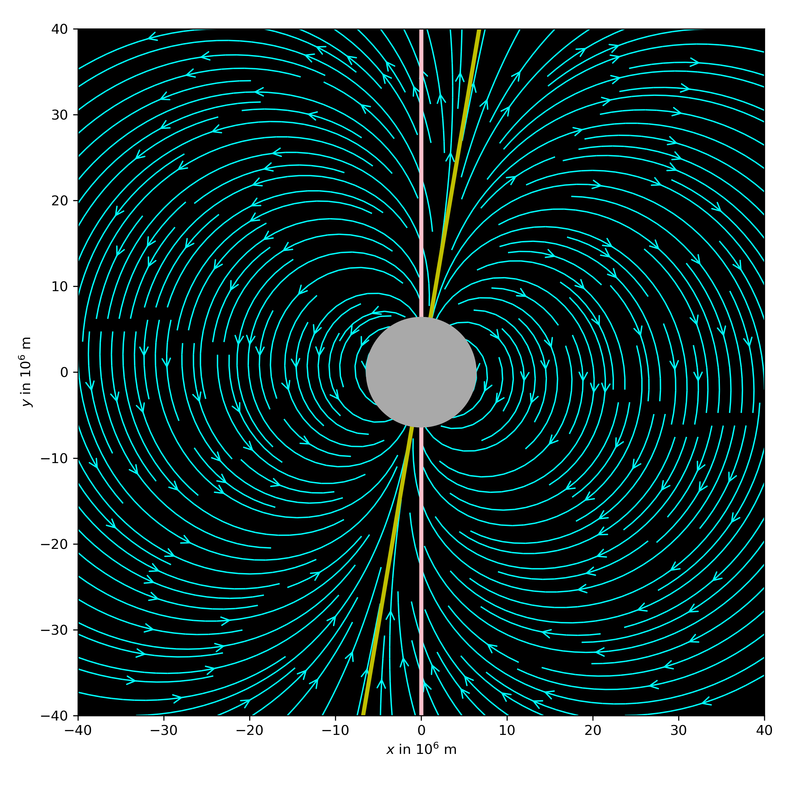

# Earth's dipolar magnetic field

The code in this repository is modified after [scipython.com](https://scipython.com/blog/visualizing-the-earths-magnetic-field/). It plots Earth's dipolar magnetic field and was used in the  blog post on [Earth's dipolar magnetic field](https://www.fabriziomusacchio.com/blog/2020-08-17-earth_dipole_field/). For further details, please refer to this post.



For reproducibility:

```powershell
conda create -n magneticfield -y python=3.7
conda activate magneticfield
conda install -y numpy matplotlib scikit-learn
```
